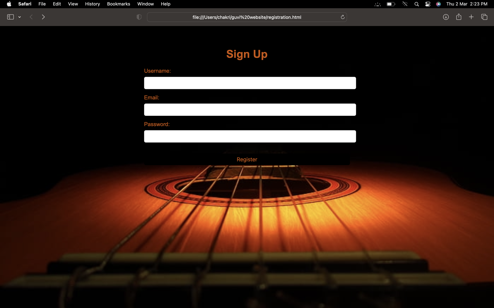
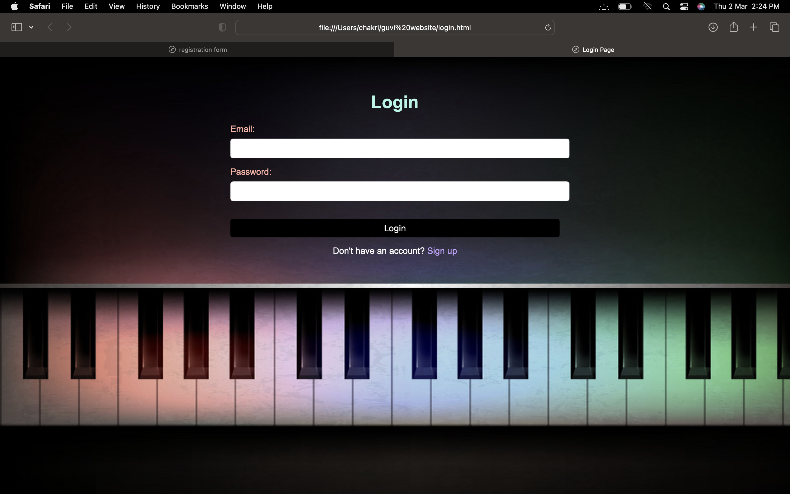

# guvi_assessment

<h1>Interface of My Website</h1>

Here is a step by step procedure of this project :

Install XAMPP: Download and install XAMPP from the Apache Friends website. XAMPP is a software package that includes Apache, MySQL, and PHP, which are required for running a web server and connecting to a database.

Start the XAMPP server: After installing XAMPP, start the XAMPP Control Panel and start the Apache and MySQL services.

Create a new database: Open PHPMYADMIN in a web browser by typing "localhost/phpmyadmin" in the address bar. Click on the "New" button to create a new database.

Create a table: In the newly created database, create a table with some columns. For example, a table named "users" with columns "id", "name", and "email".

Create an HTML file: Create a new file named "index.html" in the htdocs folder of XAMPP. This folder is located in the XAMPP installation directory. Open the file in a text editor.

Add HTML code: Add HTML code to the file. This code should include the basic structure of an HTML page, such as the HTML, head, and body tags. Add some text and images to the body of the page.

Add CSS: Create a new file named "style.css" in the same folder as "index.html". Add some CSS code to this file to style the HTML page.

Link CSS to HTML: Link the "style.css" file to the "index.html" file by adding a link tag in the head section of the HTML code.

Add JavaScript: Create a new file named "script.js" in the same folder as "index.html". Add some JavaScript code to this file to add interactivity to the HTML page.

Link JavaScript to HTML: Link the "script.js" file to the "index.html" file by adding a script tag at the end of the body section of the HTML code.

Connect to the database: Create a new file named "connect.php" in the same folder as "index.html". Add PHP code to this file to connect to the MySQL database using the mysqli_connect function.

Retrieve data from the database: Add more PHP code to the "connect.php" file to retrieve data from the "users" table using the mysqli_query function.

Display data on HTML page: Add more HTML code to the "index.html" file to display the data retrieved from the database using PHP. Use PHP echo statements to output the data in HTML tags.

Save and test: Save all the files and test the HTML page by opening it in a web browser. The page should display the text and images with the CSS styles applied and the JavaScript code executed. The data retrieved from the database should also be displayed on the page.

